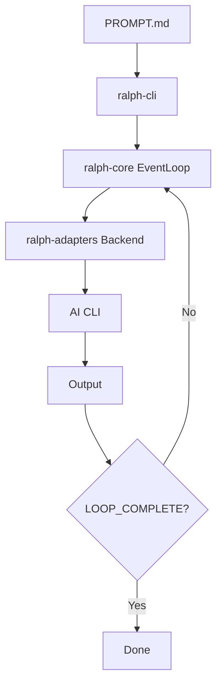
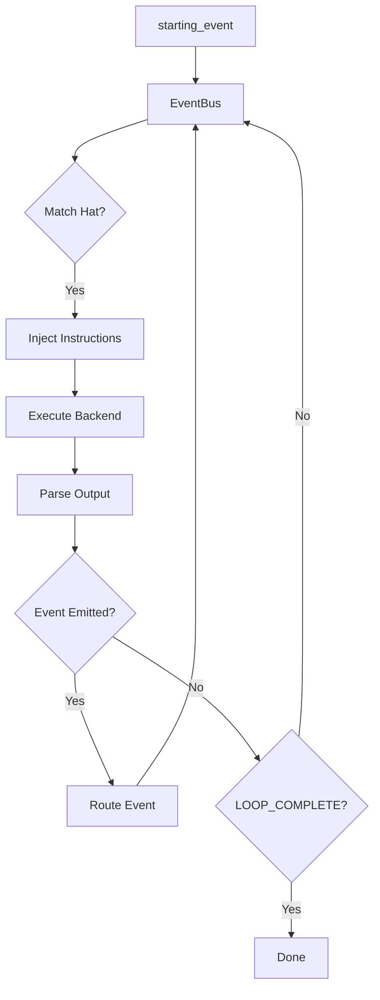

# Architecture

Ralph's system architecture and how the pieces fit together.

## Overview

Ralph is a Cargo workspace with seven crates plus a full-stack web application:

```
┌─────────────────────────────────────────────────────────┐
│                      ralph-cli                          │
│              (Binary Entry Point + Web)                 │
├─────────────┬─────────────┬─────────────┬──────────────┤
│ ralph-core  │ralph-adapters│  ralph-tui  │ ralph-e2e   │
│  (Engine)   │ (Backends)   │    (UI)     │  (Testing)  │
├─────────────┴─────────────┴─────────────┴──────────────┤
│                     ralph-proto                         │
│                  (Protocol Types)                       │
├─────────────────────────────────────────────────────────┤
│              Web Stack (Node.js / React)                │
│  backend/ (Fastify + tRPC + SQLite + REST API)         │
│  frontend/ (React + Vite + TailwindCSS + React Flow)   │
└─────────────────────────────────────────────────────────┘
```

## Crate Responsibilities

### ralph-proto

Protocol types shared across all crates.

**Key types:**

| Type | Purpose |
|------|---------|
| `Event` | Message with topic, payload, source/target hat |
| `Hat` | Persona definition (triggers, publishes, instructions) |
| `HatId` | Unique hat identifier |
| `Topic` | Event routing with glob patterns |
| `EventBus` | Hat registry and event routing |

**Location:** `crates/ralph-proto/src/`

### ralph-core

The orchestration engine.

**Key components:**

| Module | Purpose |
|--------|---------|
| `EventLoop` | Main orchestration loop |
| `config` | YAML configuration loading |
| `event_parser` | Parse agent output for events |
| `memory_store` | Persistent memory management |
| `task_store` | Task storage and querying |
| `instructions` | Hat instruction assembly |

**Location:** `crates/ralph-core/src/`

### ralph-adapters

CLI backend integrations.

**Key components:**

| Module | Purpose |
|--------|---------|
| `CliBackend` | Backend definition |
| `pty_executor` | PTY-based execution |
| `stream_handler` | Output handlers |
| `auto_detect` | Backend availability detection |

**Supported backends:**
- Claude Code
- Kiro
- Gemini CLI
- Codex
- Amp
- Copilot CLI
- OpenCode

**Location:** `crates/ralph-adapters/src/`

### ralph-tui

Terminal UI using ratatui.

**Features:**
- Real-time iteration display
- Elapsed time tracking
- Hat emoji and name display
- Activity indicator
- Event topic display

**Location:** `crates/ralph-tui/src/`

### ralph-cli

Binary entry point and CLI parsing.

**Commands:**
- `ralph run` — Execute orchestration
- `ralph init` — Initialize config
- `ralph plan` — PDD planning
- `ralph task` — Task generation
- `ralph loops` — Manage parallel loops
- `ralph web` — Launch web dashboard
- `ralph events` — View history
- `ralph emit` — Emit events
- `ralph tools` — Memory/task management
- `ralph clean` — Clean up state

**Location:** `crates/ralph-cli/src/`

### ralph-e2e

End-to-end testing framework.

**Test tiers:**

| Tier | Focus |
|------|-------|
| 1 | Connectivity |
| 2 | Orchestration Loop |
| 3 | Events |
| 4 | Capabilities |
| 5 | Hat Collections |
| 6 | Memory System |
| 7 | Error Handling |

**Location:** `crates/ralph-e2e/src/`

### ralph-bench

Benchmarking harness (development only).

**Location:** `crates/ralph-bench/src/`

### Web Stack

The web dashboard is a full-stack Node.js/React application launched via `ralph web`.

**Backend** (`backend/ralph-web-server/`):
- Fastify HTTP server with tRPC router
- SQLite database for task persistence
- REST API at `/api/v1` with 10 endpoints (tasks, hats, presets, health)
- WebSocket support for real-time log streaming
- Planning service for interactive PDD sessions
- Collection service for hat collection builder

**Frontend** (`frontend/ralph-web/`):
- React + Vite + TailwindCSS
- Task detail views with real-time log streaming
- Visual hat collection builder using React Flow (drag-and-drop canvas)
- Loop monitoring with merge actions (merge, retry, discard, stop)
- Settings page with `ralph.yml` config editor
- Steering input for needs-review loops

**Key frontend components:**
- `TaskDetailPage` — Task view with thread, metadata, and actions
- `CollectionBuilder` — Visual hat collection builder with React Flow
- `LoopActions` — Status-aware action buttons for loop management
- `SettingsPage` — Config editor for `ralph.yml`

## Data Flow

### Traditional Mode



### Hat-Based Mode



## State Management

### Files on Disk

All persistent state lives in `.ralph/`:

```
.ralph/
├── agent/
│   ├── memories.md         # Persistent learning
│   ├── tasks.jsonl         # Runtime work tracking
│   └── scratchpad.md       # Working memory (objective-scoped)
├── loop.lock               # Primary loop indicator (PID + prompt)
├── loops.json              # Loop registry for parallel loops
├── merge-queue.jsonl       # Event-sourced merge queue
├── merge-steering.txt      # User steering input for merge-ralph
├── events.jsonl            # Event audit log
├── planning-sessions/      # PDD session conversations and artifacts
│   └── {session_id}/
│       ├── conversation.jsonl
│       ├── session.json
│       └── artifacts/
├── specs/                  # Specification documents
└── diagnostics/            # Diagnostic output (when enabled)
```

### Event Bus

In-memory during execution:

```rust
struct EventBus {
    hats: HashMap<HatId, Hat>,
    pending_events: VecDeque<Event>,
    event_history: Vec<Event>,
}
```

### Configuration

Loaded from `ralph.yml`:

```rust
struct Config {
    cli: CliConfig,
    event_loop: EventLoopConfig,
    core: CoreConfig,
    memories: MemoryConfig,
    tasks: TaskConfig,
    hats: HashMap<String, HatConfig>,
}
```

## Process Model

### Unix Process Groups

Ralph manages processes carefully:

- Creates process group leadership
- Handles SIGINT, SIGTERM gracefully
- Prevents orphan processes
- Restores terminal state on exit

### PTY Handling

For real-time output capture:

```rust
// Async PTY execution with stream handling
pty_executor.execute(command, stream_handler).await
```

## Async Architecture

Ralph uses Tokio throughout:

- Async trait support
- Stream-based output capture
- Concurrent PTY handling
- Non-blocking TUI updates

## Error Handling

Custom error types with context:

```rust
// thiserror for type definitions
#[derive(Error, Debug)]
enum RalphError {
    #[error("Configuration error: {0}")]
    Config(String),
    // ...
}

// anyhow for context
fn load_config() -> Result<Config> {
    read_file(path).context("Failed to load config")?
}
```

## Extension Points

### Custom Backends

Implement `CliBackend` trait:

```rust
struct MyBackend;

impl CliBackend for MyBackend {
    fn command(&self) -> &str { "my-cli" }
    fn prompt_mode(&self) -> PromptMode { PromptMode::Arg }
}
```

### Custom Stream Handlers

Implement `StreamHandler` trait:

```rust
struct MyHandler;

impl StreamHandler for MyHandler {
    fn on_output(&mut self, chunk: &str) { ... }
    fn on_complete(&mut self) { ... }
}
```

## Performance Considerations

### Context Window

Optimize for "smart zone" (40-60% of tokens):

- Memory injection has configurable budget
- Instructions are assembled efficiently
- Large outputs are truncated

### Token Efficiency

- Events are routing signals, not data transport
- Detailed output goes to memories
- Event payloads are kept small

## Next Steps

- Explore [Event System Design](event-system.md) in depth
- Learn about [Creating Custom Hats](custom-hats.md)
- Understand [Testing & Validation](testing.md)
